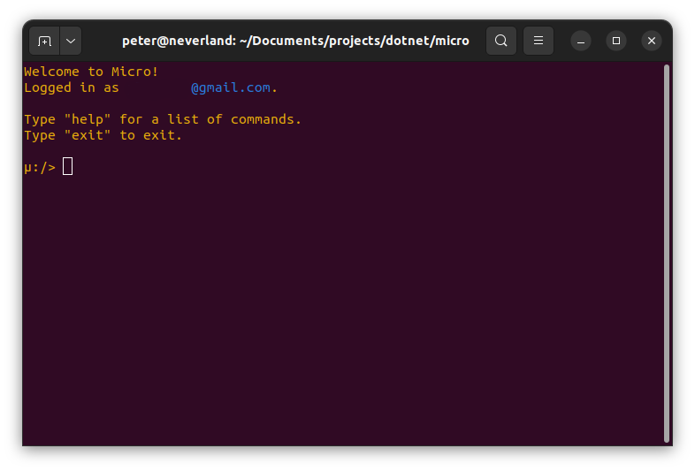

# micro

Micro is a simple open-source shell which allows you to use bash-esque commands to interact with your
[Mega](https://mega.co.nz) cloud account.

<center>

</center>

> **Note:**
> This project is not affiliated with [Mega](https://mega.co.nz).

## Installation

Download the latest micro release from the [releases page](https://github.com/sixpeteunder/micro/releases) or build
source by running `dotnet build` (Requires at least .NET 9).

## Usage

To start Micro, simply run the `micro` command:

```shell
micro
```

### Authentication

> **Note:**
> micro does not (yet) support two-factor authentication.

micro stores your authentication details locally and reuses them between sessions. To log out of micro, use:

```shell
μ:/> exit --logout 
```

### Available Commands

After starting Micro, you will be presented with the command prompt symbol `μ:/>`. From here, you can enter various
commands to interact with your MEGA cloud storage.

<center>

</center>

The following commands are available in Micro:

- `cd`: Change the current working directory.
- `clear`: Clear the screen.
- `exit`: Quit micro and optionally delete authentication details.
- `history`: Show command history.
- `get`: Download a file from MEGA to the local machine.
- `ls`: List the contents of the current directory.
- `mkdir`: Create a new directory on MEGA.
- `mv`: Move a file or directory to another location on MEGA.
- `pwd`: Print the current working directory.
- `put`: Upload a file from the local machine to MEGA.
- `rm`: Remove files or directories from MEGA.
- `stat`: Display status information for a file or directory on MEGA.
- `touch`: Create an empty file on MEGA.
- `whoami`: Display the current MEGA username.

**Note:** The following commands are currently a work in progress and not fully implemented:

- `cat`: View a file's contents on MEGA.
- `chat`: Interact with MEGA chat services.
- `cp`: Copy files or directories on MEGA.
- `edit`: Use an editor to edit files on MEGA.
- `find`: Find files or directories on MEGA.
- `rename`: Rename files or directories on MEGA.

### Usage Examples

- Change the current working directory:
  ```shell
  μ:/> cd /my_folder
  ```

- List the contents of the current directory:
  ```shell
  μ:/my_folder> ls
  ```

- Download a file from MEGA to the local machine:
  ```shell
  μ:/my_folder> get file.txt
  ```

- Show command history:
  ```shell
  μ:/my_folder> history
  ```

- Create a new directory on MEGA:
  ```shell
  μ:/my_folder> mkdir new_directory
  ```

- Move a file or directory to another location on MEGA:
  ```shell
  μ:/my_folder> mv file.txt /other_folder
  ```

- Print the current working directory:
  ```shell
  μ:/my_folder> pwd
  ```

- Upload a file from the local machine to MEGA:
  ```shell
  μ:/my_folder> put local_file.txt
  ```

- Remove files or directories from MEGA:
  ```shell
  μ:/my_folder> rm file.txt
  ```

- Display status information for a file or directory on MEGA:
  ```shell
  μ:/my_folder> stat file.txt
  ```

- Create an empty file on MEGA:
  ```shell
  μ:/my_folder> touch new_file.txt
  ```

- Display the current MEGA username:
  ```shell
  μ:/> whoami
  ```

## Help and Version

To display help information or check the version of Micro, you can use the following commands:

- Display general help information:
  ```shell
  μ:/> help
  ```

- Display help information on a specific command:
  ```shell
  μ:/> ls --help
  ```

- Check the version of Micro:
  ```shell
  μ:/> version
  ```

## Features

- [x] '.' and '..' navigation
- [x] Command history
- [ ] Command completion
- [ ] Command aliases
- [x] Character escaping
- [ ] File globbing
- [ ] File search
- [ ] 2FA

## Command Parsing

> The command line interface now fully adheres to the POSIX standard.
Commands typed into the micro shell will be parsed in the same way as those passed into any POSIX compliant CLI.  

~~In order to keep the command parser simple, some caveats are in place:~~

- ~~Lines with whitespace MUST be quoted with double quotes.~~
- ~~Quoted lines MUST always use double quotes.~~
- ~~Single quotes and backticks inside double quotes are allowed.~~
- ~~Double quotes inside double quotes are not supported (yet).~~
- ~~The path separator is `/`.~~
 
## Limitations/Gotchas

- MEGA allows files to have duplicate names, which means navigating directories with duplicate names may require manual
  selection of the correct path.
- MEGA allows slashes in node names, which may result in issues with the `cd` command and create directories when
  downloading.
